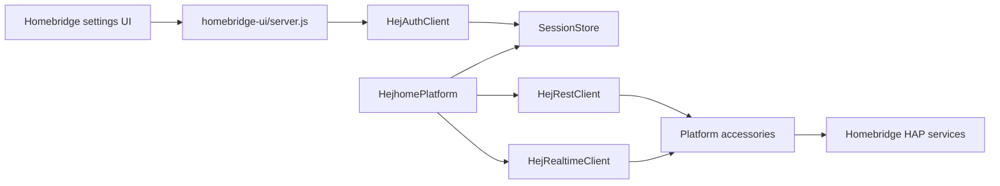

# Architecture

## Scope

This plugin bridges Hejhome cloud devices into Homebridge as a dynamic platform. It owns authentication, session persistence, device discovery, accessory lifecycle, and realtime state updates.

## Runtime Shape

## Boundaries

- `src/index.ts` registers the platform alias.
- `src/platform.ts` manages Homebridge dynamic platform lifecycle.
- `src/platformAccessory.ts` maps one Hejhome device to HomeKit service characteristics.
- `src/hej/auth.ts` owns verification, password login, and OAuth exchange.
- `src/storage/sessionStore.ts` persists session files only below `api.user.storagePath()`.
- `homebridge-ui/` owns the Homebridge Config UI custom settings screen.

## Accessory Lifecycle

Cached accessories are restored in `configureAccessory()`. New registration, updates, and removal are deferred until `didFinishLaunching`, matching Homebridge dynamic platform rules.

## Data Handling

The plugin stores access token, session cookie value, encoded username cookie, expiry, and identifier. It does not store passwords or verification codes. Logs and documentation validation redact token, cookie, password, authorization, and email-like material.
