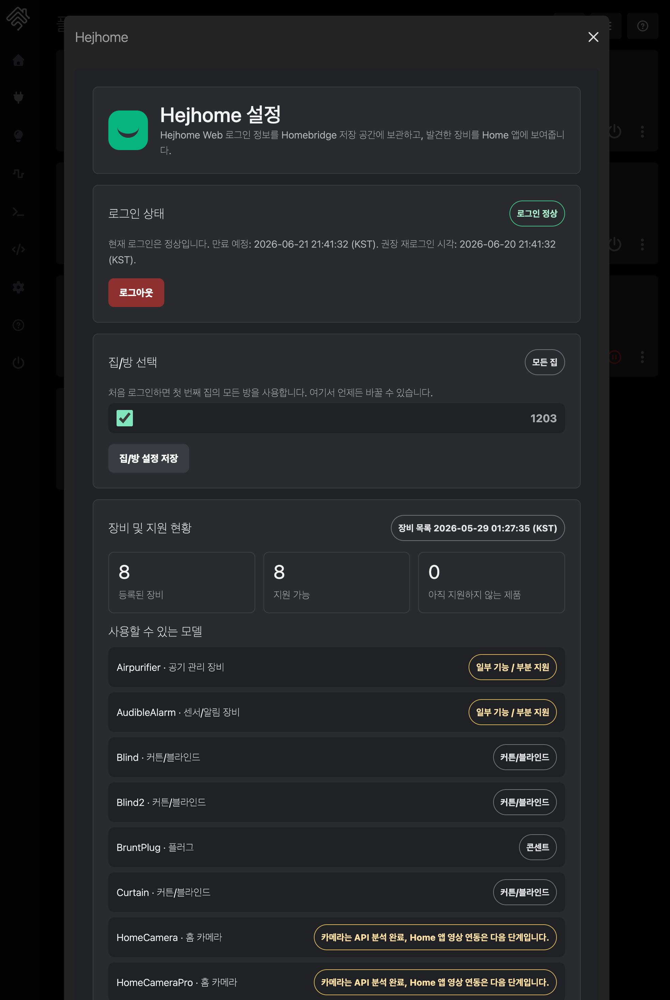
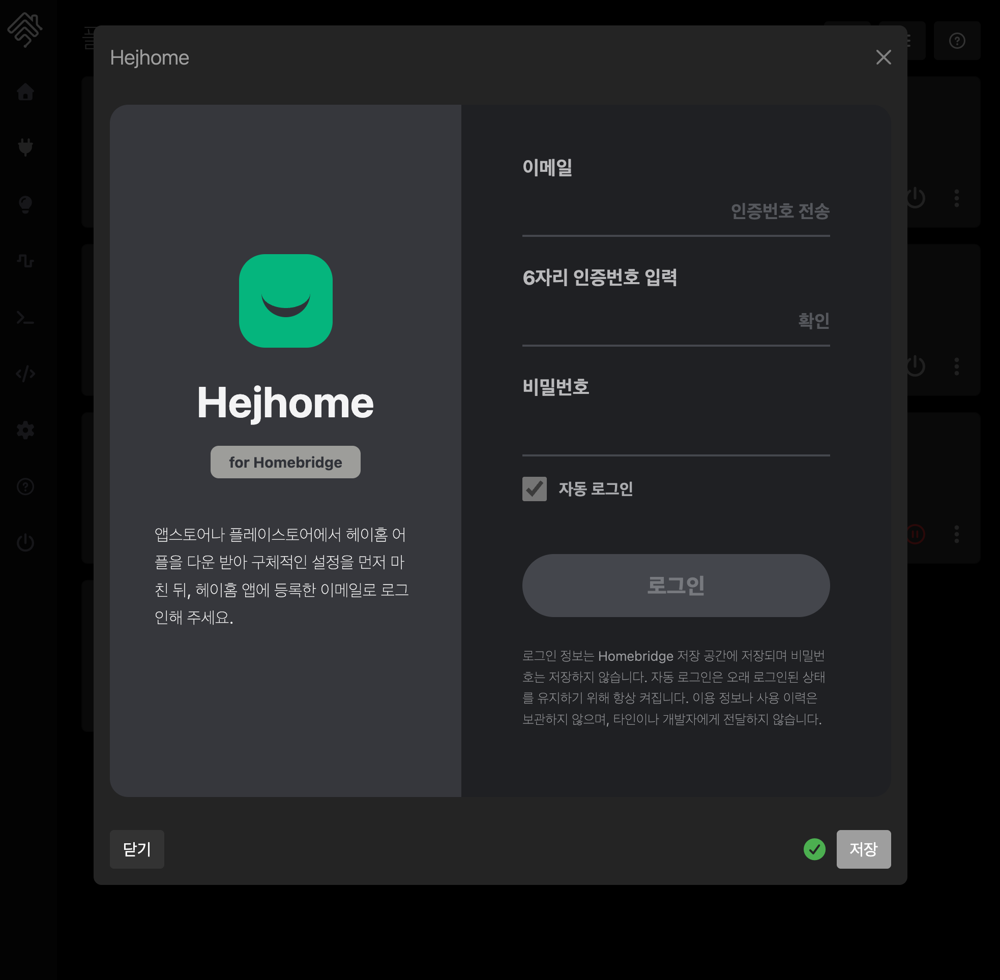

<p align="center">
  
</p>

<h1 align="center">Homebridge Hejhome</h1>

<p align="center">
  <strong>헤이홈 기기를 Apple Home으로 연결하고, 지원 기기를 Matter로 확장하세요.</strong>
</p>

<p align="center">
  
  
  
</p>

## 헤이홈 기기를 익숙한 스마트홈에서

`@chazepps/homebridge-hejhome`은 헤이홈 앱에 등록한 조명, 스위치, 플러그와 센서를 Homebridge에 연결하는 **비공식 오픈소스 플러그인**입니다. Apple Home에서 지원 기기를 조작하고, Siri와 Home 앱 자동화에 활용할 수 있습니다. 3.0 베타에서는 Matter를 통해 Google Home·SmartThings 등으로 연결할 수 있는 범위도 넓힙니다.

- **설정 화면에서 시작:** 이메일 인증과 로그인 후 사용할 집과 방을 선택합니다.
- **필요한 장치만 연결:** 장치별로 Apple Home·Matter 연결, 표시 이름과 지원되는 장치 형태를 설정합니다.
- **문제가 생기면 상태부터 확인:** 로그인, 장치 발견, 연결 준비, 최근 상태 수신과 명령 결과를 한 화면에서 확인합니다.

헤이홈 클라우드를 이용하므로 헤이홈 계정과 인터넷 연결이 필요합니다. 플러그인을 설치해도 기기에 로컬 통신이나 Thread 기능이 생기는 것은 아닙니다. 헤이홈 제조사와 독립적으로 유지보수합니다.

> **3.0 베타 출시 준비:** 현재 버전은 **3.0.0-beta.1**이며 아직 npm에 게시하지 않았습니다. 게시 후 Homebridge UI에서 해당 베타 버전을 선택하거나 버전 번호를 지정해 설치할 수 있습니다. `beta` 채널은 정식 버전의 `latest`와 구분하며, 정식 버전의 일반 업데이트로 이 베타가 설치되지는 않습니다. [베타 사용 안내](docs/product-specs/3.0-beta-guide.md)에서 상세 범위를 확인하세요.

[설치·로그인](#시작하기) · [2.x에서 업데이트](#2x에서-업데이트하기) · [지원 기기](#지원-기기와-기능) · [문제 해결](#연결이-안-될-때) · [기능 체크리스트](docs/exec-plans/2026-09-30-homebridge-feature-action-checklist.md)

## 3.0 업데이트: 연결 확장과 일상 사용의 신뢰성 개선

3.0 베타는 Homebridge 2.4 이상을 기준으로 **스마트홈 연결을 넓히고, 여러 앱에서 같은 기기를 조작할 때 상태를 일관되게 유지하도록 개선한 버전**입니다. Matter, 적응형 조명, 전력 측정과 함께 재로그인·재연결·동시 조작·설정 저장 과정도 점검했습니다.

| 개선 영역 | 이번 대응 | 사용자가 체감하는 변화 |
| --- | --- | --- |
| 스마트홈 연결 확장 | Homebridge 2.4+의 HAP·Matter API와 Node 22·24·26 대응 | 지원 장치를 사용할 앱에 맞춰 연결 |
| 제어 순서와 상태 동기화 | 장치별 명령 처리, 최신 수신 상태 보호, 요청 제한 | 늦게 도착한 응답으로 새 상태가 되돌아가는 문제를 방지하도록 개선 |
| 로그인·연결 복구 | 새 로그인 정보 감지, 재연결 후 재탐색, 불완전한 조회 결과 보호 | 재로그인 뒤 연결을 다시 준비하고, 일시적인 조회 실패로 장치를 지우지 않음 |
| 확인 가능한 상태 표시 | 현재값·설정값·이전 기록과 명령 전송 결과를 구분 | 측정되지 않은 값을 정상값으로 오인하지 않고 문제 위치를 확인 |
| 설정 화면 사용성 | 장치별 설정, 실시간 진단, 입력 중 내용 보존, 한영·테마 대응 | 연결을 점검하면서 설정을 편집하고 모바일에서도 사용 |

이 과정에서 실제 Homebridge HAP 객체와 Matter endpoint를 사용하는 테스트, 장애·재시작·동시 제어 회귀 테스트, 브라우저 테스트를 보강했습니다. 코드·인터페이스 검증과 실제 기기 검증은 별도로 기록합니다. **지원 범위를 명확히 하고, 실패 상황까지 확인하는 것이 이 프로젝트의 개발 기준입니다.**

베타는 `beta` 채널로 분리하며, 사용자가 직접 선택해야 설치됩니다. Matter와 적응형 조명도 기본값은 꺼짐입니다. Hejhome 베타를 사용하기 위해 Homebridge core 베타나 UI 알파를 설치할 필요는 없습니다.

## 2.x에서 업데이트하기

3.0은 실행 환경과 일부 장치의 표시 방식이 달라집니다. 업데이트 전에 Homebridge 백업을 만들고 아래 내용을 확인하세요.

| 변경 사항 | 확인할 내용 |
| --- | --- |
| Homebridge 2.4 이상 필요 | Homebridge 1에서는 플러그인 2.0 계열을 유지합니다. Node.js도 [실행 환경 요구사항](#1-실행-환경-확인)을 확인하세요. |
| 에어컨 표시 변경 | 실제 운전 상태가 없는 온도조절기 서비스를 제거합니다. 전원 제어와 설정 화면의 온도·운전 방식 조작을 사용하세요. |
| 스마트 버튼 표시 변경 | 눌림 이벤트가 확인되지 않은 버튼 서비스를 제거합니다. 기존 자동화에 연결했다면 확인하세요. |
| 새 연결·표시 옵션 | 기존 장치 식별자는 유지합니다. 연결 방식이나 서비스 형태를 바꾸면 앱에서 장치가 다시 나타나거나 자동화 수정이 필요할 수 있습니다. |

설정과 장치 목록을 확인한 뒤, 사용하는 앱에서 주요 장치와 자동화를 점검하세요. 연결 문제의 첫 조치로 액세서리 캐시나 기존 페어링을 초기화하지 마세요.

### 정식 버전으로 돌아가기

새 연결 옵션을 끄고 [복귀 절차](docs/product-specs/3.0-beta-guide.md#정식-버전으로-돌아가기)에 따라 `@latest`를 설치합니다. 2.0 계열로 돌아갈 때는 이전 스키마에 없는 `features` 설정을 제거해야 합니다. 일반적인 복귀 과정에서 기존 Apple Home 연결을 초기화할 필요는 없습니다.

## 시작하기

### 1. 실행 환경 확인

아래는 **3.0 베타 릴리스**의 요구사항입니다.

| 항목 | 요구사항 |
| --- | --- |
| Homebridge | 2.4 이상, 2.x 계열 |
| Homebridge UI | 5.29 이상 |
| Node.js | 22.13.0 이상인 22.x, 24.x 또는 26.x |
| 헤이홈 | 앱에 기기가 등록된 계정과 이메일 로그인 |
| 네트워크 | 헤이홈 클라우드 접속. Matter 연결 시 같은 네트워크의 IPv6·mDNS 동작 필요 |

설정 화면의 새 리모컨 기능은 현재 macOS/Linux에서 제공합니다. Windows에서는 이 화면의 리모컨 조작을 사용할 수 없습니다. 기기별 기능과 운영체제 제한은 [베타 안내](docs/product-specs/3.0-beta-guide.md)를 확인하세요.

### 2. 플러그인 설치

Homebridge UI의 플러그인 메뉴에서 `@chazepps/homebridge-hejhome`을 찾아 설치합니다. npm을 사용한다면 실행 중인 Homebridge와 같은 설치 환경에서 명시적으로 채널을 선택할 수 있습니다.

```sh
# 공개된 정식 버전 설치
npm install -g @chazepps/homebridge-hejhome@latest
```

**3.0.0-beta.1은 아직 게시 전입니다.** 아래 명령은 해당 버전이 게시된 뒤 사용할 설치 예시입니다. 이전에 게시된 베타가 있다면 `@beta`가 그 버전을 가리킬 수 있으므로 설치할 버전 번호를 확인하세요.

```sh
# 3.0.0-beta.1 게시 후 이 버전을 직접 선택
npm install -g @chazepps/homebridge-hejhome@3.0.0-beta.1

# 게시된 베타 채널을 선택할 때
npm install -g @chazepps/homebridge-hejhome@beta
```

플러그인 베타 설치와 기능 켜기는 별개입니다. Matter와 적응형 조명은 설치 후에도 설정에서 직접 켜야 합니다.

### 3. 로그인하고 장치 선택

1. Hejhome 플러그인 설정을 엽니다.
2. 헤이홈 계정의 이메일로 인증번호를 받고 인증을 완료합니다.
3. 비밀번호로 로그인합니다. 비밀번호와 인증번호는 저장하지 않습니다.
4. 사용할 집과 방을 선택합니다. 처음에는 첫 번째 집의 모든 방을 사용합니다.
5. 연결 설정을 저장하고 안내에 따라 Homebridge를 다시 시작합니다.

직접 `config.json`을 편집한다면 최소 설정은 다음과 같습니다. 로그인 정보는 설정 화면에서 별도로 입력합니다.

```json
{
  "platform": "Hejhome",
  "name": "Hejhome"
}
```

<details>
<summary>설정 화면 예시 보기</summary>

기존 로그인·설정 화면의 예시입니다. 3.0 베타에서 추가한 옵션과 배치는 이미지와 다를 수 있습니다.

<p align="center">
  
</p>

<p align="center">
  
</p>

</details>

## 지원 기기와 기능

아래는 **3.0 베타 릴리스의 지원 범위**입니다. 같은 제품군이라도 모델과 제공되는 상태값에 따라 기능이 달라집니다. 모든 모델의 실물 검증이 완료되었다는 뜻은 아닙니다.

| 제품군 | Apple Home | Matter 및 추가 기능 |
| --- | --- | --- |
| RGB/RGBW 조명·LED 스트립 | 전원, 밝기, 색상 | 지원 장치의 전원·밝기·색상, 상대·연속 밝기 조절 |
| 색온도 조명 | 전원, 밝기, 색온도, 적응형 조명 | 전원·밝기·색온도. 적응형 조명은 Apple Home에서 설정 |
| 벽 스위치·릴레이 | 전원, 다중 스위치의 개별 제어 | 개별 켜기·끄기 |
| 플러그·멀티탭 | 전원, 개별 콘센트 제어 | 전원, 보정 설정이 있는 모델의 전력 측정 |
| 커튼·블라인드 | 위치 확인과 목표 위치 제어 | 위치 제어. 정지·각도 조절은 미지원 |
| 모션·문 열림 센서 | 해당 감지 상태 | 해당 감지 상태 |
| 온습도 센서 | 온도·습도 | 온도·습도 |
| 누수·연기 센서 | 해당 경보 상태 | 해당 경보 상태 |
| 공기청정기 (`Airpurifier`) | 전원, 배율을 직접 설정한 경우 PM2.5 읽기 | 전원, 같은 보정 설정의 PM2.5 읽기. 설정 화면에서 자동·수동·취침 모드 선택 |
| 지원 도어락 (`ZigbeeDoorlock`) | 문 열림 상태 읽기 | 문 열림 상태 읽기. 잠금 상태나 잠금·해제 제어는 제공하지 않음 |

Matter 연속 밝기 조절은 밝기 명령을 최소 1초 간격으로 보내는 방식이며, 20초 동안 최대 20회로 제한합니다. 실물 조명과 Google Home·SmartThings에서의 조작감·동작 확인은 아직 남아 있습니다.

배터리 정보를 제공하는 기기는 배터리 상태도 반영합니다. 센서값이 없거나 확인되지 않으면 정상값을 추정하지 않는 방향으로 처리하며, 상태 정확성과 복구 동작은 회귀 테스트로 점검합니다.

### IR 리모컨 장비

IR 장비는 실제 상태를 돌려주는지에 따라 표현을 구분합니다. 전원 상태를 알 수 없는 기기는 Apple Home에서 **순간 전원 버튼**으로 표시하며, 실제 켜짐·꺼짐을 확정해서 보여주지 않습니다. Matter의 절대 전원 제어는 상태를 확인할 수 있는 지원 장치로 제한합니다.

| 제품군 | 제공 범위 |
| --- | --- |
| TV·셋톱박스 | 전원 제어 또는 전원 버튼. 설정 화면의 음량·채널·음소거 조작, 선택 시 Apple Home 순간 리모컨 버튼 6개 |
| 선풍기 | 전원 상태가 있으면 선풍기 전원 제어, 없으면 전원 버튼. 선택 시 Apple Home에 바람 세기·회전 버튼 2개 추가 |
| 에어컨 | Apple Home 전원 제어. 설정 화면에서 기기가 알려준 설정 온도·운전 방식·바람 세기 확인과 변경 |
| 기타 지원 IR 장비 | 확인된 전원 명령 범위 |

Apple Home 리모컨 버튼은 기본적으로 꺼져 있습니다. 장치별 **리모컨 버튼을 Apple Home에 표시**를 켜고 저장한 뒤 재시작하면 기존 기기에 추가됩니다. 버튼을 누르면 명령을 한 번 보내고 다시 꺼지며, 기기의 실제 동작 상태를 뜻하지 않습니다. 채널 번호 입력은 설정 화면에서 사용합니다.

선풍기의 바람 세기·회전 버튼은 리모컨을 한 번 누르는 명령입니다. 현재 풍량 단계나 회전 상태를 확인해 표시하는 기능은 아닙니다.

에어컨의 실제 운전 상태를 확인할 수 없어 HAP/Matter 온도조절기 위젯은 제공하지 않습니다. 별도 헤이홈 온도계를 연결하면 설정 화면에서 실제 현재 온도를 함께 확인할 수 있습니다.

### 아직 제공하지 않는 기능

스마트 버튼의 클릭 자동화, 레이더의 지속 재실 감지, 커튼 정지·각도 조절, 미보정 공기질 측정·필터 기능, RGBW 색온도 확장·장면 프리셋, 카메라 영상·HKSV, 도어락 잠금·해제는 제공하지 않습니다. 카메라 연결을 위한 내부 코드가 있어도 사용자에게 영상 기능을 제공하는 단계는 아닙니다. 확인되지 않은 기기를 임의의 제어 장치로 등록하지 않습니다.

<details>
<summary>기술 지원용 Hejhome 장치 타입</summary>

제품에 붙은 모델명과 API의 장치 타입은 다를 수 있습니다. 지원 요청 시 설정 화면의 모델 정보를 함께 확인해 주세요.

| 제품군 | 주요 장치 타입 |
| --- | --- |
| RGB/RGBW·스트립 | `LightRgbw1`–`LightRgbw5`, `LightRgb4`, `LightRgb5`, `LedStripRgb`, `LedStripRgbw1`, `LedStripRgbw2` |
| 색온도 조명 | `LightWw1`, `LightWw2`, `LightWw3` |
| 벽 스위치 | `Switch1`–`Switch6`, `ZigbeeSwitch1`–`ZigbeeSwitch3` |
| 릴레이 | `Relay`, `RelayController`, `RelayController2`, `RelayControllerDc`, `RelayControllerDc2` |
| 플러그·멀티탭 | `Plug`, `SmartPlug`, `BruntPlug`, `PowerStrip`, `PowerStrip2` |
| 커튼·블라인드 | `Curtain`, `Blind`, `Blind2` |
| 센서 | `SensorMo`, `SensorDo`, `SensorTh`, `SensorTh2`, `SensorRefTh`, `SensorRefTh2`, `SensorWater2`, `SensorWater3`, `SensorSmoke3`, `SensorSmoke4` |
| IR 장비 | `IrTv`, `IrSettopbox`, `IrProjector`, `IrLamp`, `IrSpeaker`, `IrDvd`, `IrTvbox`, `IrCamera`, `IrDIY`, `IrAirconditioner`, `IrFan` |
| 공기청정기·문 열림 | `Airpurifier`, `ZigbeeDoorlock`의 위 표에 적힌 기능만 |
| 범위 확인 중 | `SensorRadar` 등 부분 지원·보류 타입 |

구현 정의는 [장치별 지원 목록](src/devices/capabilities.ts), 세부 제한은 [베타 안내](docs/product-specs/3.0-beta-guide.md)를 참고하세요.

</details>

## 연결과 설정

**Matter 연결:** 플러그인 옵션과 Homebridge의 해당 브리지에서 Matter를 켠 뒤, 사용할 앱에서 Matter QR로 연결합니다. 같은 앱에 HAP와 Matter로 같은 기기를 연결하면 중복 표시될 수 있습니다. Homebridge의 Matter는 커뮤니티 구현이며 인증된 상용 Matter 제품은 아닙니다.

**적응형 조명:** 지원하는 색온도 조명에서 플러그인 옵션을 켜고 Apple Home에서도 적응형 조명을 선택합니다. 색온도는 클라우드 명령으로 주기적으로 갱신됩니다. RGBW라는 이름만으로 색온도 조절을 지원한다고 가정하지 않습니다.

**소비전력 사양:** 등록된 장치를 목록에서 확인하고 소비전력·대기전력을 W 단위로 입력합니다. 같은 모델도 장치별로 따로 저장하며, 빈칸은 미설정이고 `0`은 유효한 입력값입니다. 이 값은 사용자 사양으로 보관하며 실제 측정값이나 누적 사용량으로 표시하지 않습니다. [입력 안내](docs/product-specs/3.0-beta-guide.md#소비전력-사양)를 참고하세요.

**전력 측정:** 실제 측정 항목과 단위를 확인한 모델에만 보정 설정을 적용합니다. Matter에는 전력·전류·전압·누적 사용량을 제공할 수 있고, 보정된 단일 플러그는 Apple Home에서 전원과 실제 부하 사용 여부를 구분합니다. 누적 데이터가 없으면 사용량을 추정해 만들지 않습니다. [계측 설정 예시](docs/product-specs/3.0-beta-guide.md#전력-측정)를 참고하세요.

**PM2.5 측정:** `Airpurifier`에서 원본 측정값을 µg/m³로 바꾸는 배율을 직접 확인한 경우에만 **고급: PM2.5 측정값 보정**을 설정합니다. 기본값은 미사용이며, 설정하면 장치별 연결 선택에 따라 Apple Home·Matter 또는 양쪽에 읽기 전용 측정 항목을 제공합니다. 배율을 지우고 재시작하면 측정 항목만 제거됩니다. 공기질 등급이나 필터 수명은 추정하지 않습니다. [보정 안내](docs/product-specs/3.0-beta-guide.md#공기청정기와-pm25-측정)를 확인하세요.

**측정값 유효 시간:** 기본적으로 온습도·PM2.5는 90분, 전력 측정은 5분 동안 새 보고가 없으면 확인할 수 없는 값으로 처리합니다. 장치별로 5~1440분을 선택할 수 있고 비워 두면 자동 기준을 사용합니다. 이 시간은 플러그인의 표시 기준이며, 기기의 보고 주기나 오프라인 판정과는 다릅니다.

**장치별 설정:** 사용할 연결 방식, 표시 이름과 허용된 표시 형태를 선택합니다. 연결 방식이나 형태를 바꾸면 앱에 장치가 다시 나타나거나 Matter를 다시 연결해야 할 수 있습니다. 저장 화면의 안내와 기존 자동화를 확인해 주세요.

**Smart Automation:** Homebridge UI 6 알파의 자동화 연계는 별도 시험 항목입니다. 공식 규칙 코드에서 확인한 제한과 설정 예시는 [자동화 가이드](docs/product-specs/smart-automation-guide.md)에 정리했습니다. 플러그인 베타의 기본 사용에 UI 알파는 필요하지 않습니다.

## 연결이 안 될 때

먼저 플러그인 설정의 **연결 상태 살펴보기**를 확인하세요. 장치가 발견된 상태, Homebridge에서 연결을 준비한 상태, 실제 앱에 연결된 상태는 서로 다릅니다.

| 증상 | 확인할 내용 |
| --- | --- |
| 장치 상태는 바뀌는데 제어가 안 됨 | 로그인이 만료되었는지 확인하고 다시 로그인합니다. 상태 수신과 제어 인증은 서로 다를 수 있습니다. |
| 장치가 보이지 않음 | 선택한 집·방, 장치별 숨김 설정, 지원 범위를 확인합니다. 설정 변경 후 재시작이 필요한지도 확인합니다. |
| 같은 장치가 두 개로 보임 | 같은 앱에 Apple Home 연결과 Matter 연결을 모두 추가했는지 확인합니다. |
| 센서값이나 PM2.5가 확인되지 않음 | 새 측정 보고가 들어왔는지, 유효 시간이 지났는지 확인합니다. PM2.5는 확인한 단위에 맞는 보정 배율도 필요합니다. |
| 리모컨 버튼을 사용할 수 없음 | 실행 중인 플러그인이 준비됐는지, 최신 상태를 받고 있는지, 해당 환경에서 리모컨 기능을 지원하는지 확인합니다. |
| 명령 응답이 늦거나 실패함 | 실물 동작을 확인한 뒤 다시 조작합니다. 응답을 못 받았다고 실제 명령이 실행되지 않았다고 단정할 수는 없습니다. |
| 에어컨·버튼 표시가 이전과 달라짐 | 확인되지 않은 상태나 이벤트를 제공하던 서비스를 정리한 변경입니다. 지원 범위와 연결된 자동화를 확인합니다. |

`명령 전송 완료`는 헤이홈 서버가 요청에 응답했다는 의미입니다. 장치가 실제로 동작했는지는 뒤이어 받은 상태나 실물로 확인해야 합니다.

문제가 계속되면 설정 화면의 진단 내용과 지원 요청 템플릿을 이용해 [GitHub 이슈](https://github.com/chazepps/homebridge-hejhome/issues)를 등록해 주세요. 설치 버전, 모델, 재현 순서와 문제 발생 시각을 적으면 원인을 찾는 데 도움이 됩니다. 비밀번호·인증번호·토큰·쿠키는 공유하지 마세요.

## 개인정보와 검증

로그인 세션은 `config.json`과 분리해 Homebridge 저장 공간에 보관합니다. 비밀번호와 인증번호는 저장하지 않습니다. 최근 장치 상태와 문제 확인용 로그도 해당 Homebridge에 저장하며, 민감한 인증 정보는 로그에서 가립니다. 개발자에게 진단 내용을 자동으로 보내지 않습니다.

이 프로젝트는 TypeScript 기반 **Dynamic Platform Plugin**으로, 인증·장치 발견·HAP/Matter 매핑·상태 관리·설정 UI를 분리합니다. 기능 변경 시 다음 범위를 확인합니다.

- 실제 Homebridge HAP 객체와 Matter endpoint를 이용한 인터페이스·등록·복원 테스트
- 세션 교체, 재연결, 동시 명령, 늦은 응답, 결측값과 종료 처리 회귀 테스트
- 설정 저장·진단 갱신·한영·테마·모바일 화면을 확인하는 Playwright 테스트
- lint, 타입 검사, 빌드, 문서와 npm 패키지 구성 검사

CI는 Node 22·24·26과 Homebridge 정식·베타 조합을 대상으로 구성되어 있습니다. 릴리스 워크플로는 검증 후 버전·태그·배포 채널의 일치를 확인하고 npm Trusted Publishing과 provenance를 사용하도록 구성했습니다. 사전 릴리스는 `beta` 채널로 분리합니다.

코드 검증과 남은 실기 확인 사항은 [기능 체크리스트](docs/exec-plans/2026-09-30-homebridge-feature-action-checklist.md)에서 구분합니다. 자동화 테스트 통과를 모든 모델의 실물 동작 보장으로 확대하지 않습니다.

## 개발과 기여

로컬 개발에는 `.nvmrc`의 Node 버전을 사용합니다.

```sh
nvm use
npm ci
npm run build
npm run homebridge:dev
```

설정 UI를 함께 실행하려면 `npm run homebridge:ui`를 사용합니다. 개발용 설정은 `test/hbConfig/config.json`에 있습니다.

```sh
# 코드·UI·빌드·문서 검증
npm run verify

# 배포 패키지 구성 확인
npm pack --dry-run
```

| 경로 | 역할 |
| --- | --- |
| `src/platform.ts` | 장치 발견, 연결 수명주기와 공통 명령 처리 |
| `src/platformAccessory.ts` | HomeKit 서비스와 기기 제어 매핑 |
| `src/matter/` | Matter 장치·상태·조광 처리 |
| `src/runtime/` | 연결 상태, 진단, 관측 순서와 UI 명령 전달 |
| `src/devices/`, `src/media/` | 장치 기능, 명령 변환과 IR 리모컨 처리 |
| `src/hej/`, `src/storage/` | 헤이홈 인증·REST·MQTT와 로컬 저장 |
| `homebridge-ui/` | 사용자 설정 화면과 UI 서버 |
| `tests/`, `docs/` | 회귀 테스트, 설계·지원 범위·검증 기록 |

새 장치를 지원할 때는 모델과 실제 보고값·명령 의미를 먼저 확인하고, 관련 테스트와 지원 문서를 함께 갱신합니다. 개인정보를 제외한 재현 자료와 테스트가 포함된 Pull Request를 환영합니다.

개발에는 Codex와 자동화 도구를 활용하며, 코드 리뷰와 테스트 결과를 바탕으로 변경을 검토합니다. 자세한 구조와 보안 원칙은 [아키텍처](ARCHITECTURE.md), [문서 목록](docs/README.md), [보안 안내](docs/SECURITY.md)를 참고하세요.

## 라이선스

[ISC](LICENSE).
