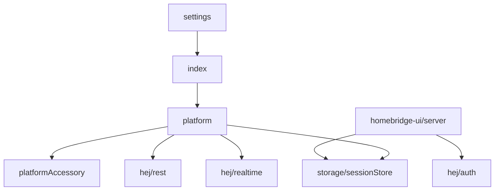

# Design

## Entrypoints

- `src/index.ts` exports the Homebridge plugin initializer.
- `src/settings.ts` defines `PLUGIN_NAME` and `PLATFORM_NAME`.
- `src/platform.ts` implements the dynamic platform.
- `homebridge-ui/server.js` exposes settings UI endpoints.
- `homebridge-ui/public/index.html` renders the custom settings UI.

## Module Groups

## Design Decisions

- Use a dynamic platform only.
- Keep the UI server and runtime platform independent except for shared auth and storage modules.
- Store sessions under Homebridge storage, not under the repository or process cwd.
- Use stable Homebridge UUIDs derived from Hejhome device ids.
- Keep archived code out of the runtime dependency graph.

## Change Anchors

Any change to authentication must update `tests/hej-auth.test.ts`, `tests/ui/login-ui.spec.ts`, and `docs/project-avatar/architectures/hej-auth-session.md`.
