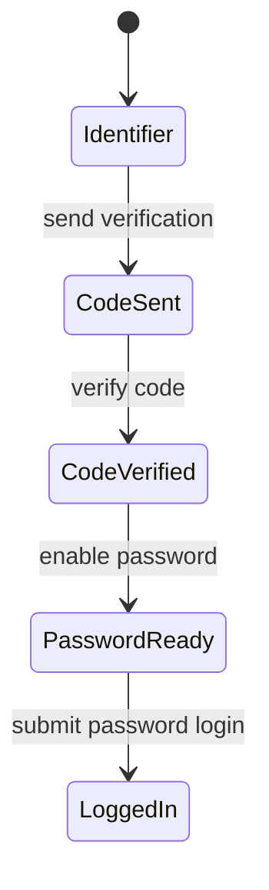

# Frontend

## Surface

The only frontend surface is the Homebridge custom plugin settings UI at `homebridge-ui/public/index.html`.

## Homebridge UI Rules

- The file does not include `<html>`, `<head>`, or `<body>` tags.
- Bootstrap classes may be used because Homebridge injects the environment styling.
- The UI communicates with `homebridge-ui/server.js` through `window.homebridge.request`.
- The UI saves config through `updatePluginConfig()` followed by `savePluginConfig()`.

## Login State Machine

Password input is disabled until code verification succeeds. Login is disabled until password input contains a value. Auto-login is checked and disabled by design.

## Test Anchors

- `tests/ui/login-ui.spec.ts` verifies iframe restrictions, field state, and request order.
