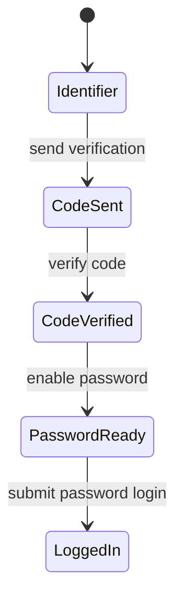

# Frontend

## Surface

The only frontend surface is the Homebridge custom plugin settings UI at `homebridge-ui/public/index.html`. After sign-in it opens **My Devices**, with **Connections** and **Help** as two other tabs. A device's controls and settings live in its detail view.

## Homebridge UI Rules

- The file does not include `<html>`, `<head>`, or `<body>` tags.
- Bootstrap classes may be used because Homebridge injects the environment styling.
- The UI communicates with `homebridge-ui/server.js` through `window.homebridge.request`.
- The Homebridge host wraps this HTML fragment in its iframe, injects `plugin-ui-utils`, and adjusts iframe height from the body. Call `fixScrollHeight()` after view changes and clean up plugin event subscriptions and timers on page hide.
- The UI saves through `window.homebridge.request()` to the custom server's `/save-scope`, `/save-features`, and `/save-device-settings` handlers. It does not use parent `updatePluginConfig()` or `savePluginConfig()` for these edits.

## Login State Machine

```mermaid
stateDiagram-v2
  [*] --> Identifier
  Identifier --> CodeSent: send verification
  CodeSent --> CodeVerified: verify code
  CodeVerified --> PasswordReady: enable password
  PasswordReady --> LoggedIn: submit password login
```

Password input is disabled until code verification succeeds. Login is disabled until password input contains a value. Auto-login remains the authentication behavior and is explained in the UI.

## Test Anchors

- `tests/ui/login-ui.spec.ts` verifies iframe restrictions, field state, and request order.
- `tests/ui/navigation-workflow.spec.ts` verifies tabs, device detail, draft/focus preservation, delayed responses, and command results.
- `tests/ui/appearance.spec.ts` and `tests/ui/accessibility.spec.ts` cover two languages, two themes, responsive layout, and keyboard access.
- `tests/ui/meter-table.spec.ts` covers the illustrative reference row, observed-model picker, unit conversion labels, profile validation, draft preservation, and horizontal table navigation.

## 3.0 beta customer settings

Device settings use stable device identifiers. Drafts, focus, and selection survive status updates and tab/detail navigation; saved changes apply only after the relevant server response. Scope edits require the server's current account and edit token, and old account responses cannot replace the current view. Host language and lighting mode select Korean/English and light/dark presentation. Help holds connection diagnostics and advanced meter setup. Cache presence is never described as completed pairing. Expert meter editing and form editing share one saved value. UI controls use the runtime command channel and distinguish an acknowledged command from confirmed physical behavior. See the beta guide for supported remote buttons and platform limits.

The advanced meter table uses one row per model and measurement kind. The columns are model, kind, calculation input, multiplier, computed result, and removal. Rows sharing a model are grouped into one saved profile; a repeated model/kind pair is rejected. Existing profiles are flattened without changing their source field codes, including custom codes. Selecting a new measurement kind uses its default source code, while custom source mapping remains editable in the expert JSON view. Model suggestions come only from current in-scope diagnostics and do not establish metering support or calibration.

Calculation inputs are temporary UI values, not live telemetry or configuration. The read-only result multiplies that number by the configured factor and uses the selected kind's unit. Empty or invalid inputs must not leave a stale result. Preview-only changes must not mark configuration dirty or leak into JSON, requests, or saved profiles. Normal status updates and save responses preserve active drafts and calculator inputs; the expert editor retains its explicit validated apply flow. When the account changes without configuration drafts, the previous meter table and previews are cleared, and saves stay locked until a fresh status for the current account is accepted. Reload generation and account revision checks reject late responses from earlier accounts. Actual configuration drafts still require the existing discard confirmation. A static italic reference row is never submitted. The table uses native horizontal overflow, single-line cells, accessible icon actions, and a definition list below the table explaining what each column accepts and saves.
