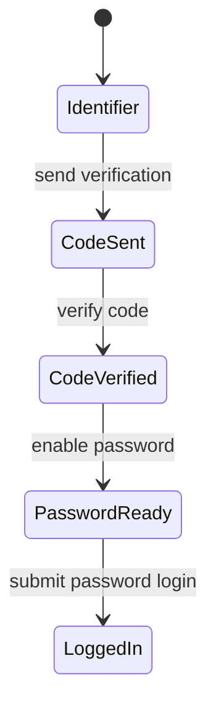

# Frontend

## Surface

The only frontend surface is the Homebridge custom plugin settings UI at `homebridge-ui/public/index.html`. After sign-in it opens **My Devices**, with **Connections** and **Help** as two other tabs. A device's controls and settings live in its detail view.

## Homebridge UI Rules

- The file does not include `<html>`, `<head>`, or `<body>` tags.
- Bootstrap classes may be used because Homebridge injects the environment styling.
- The UI communicates with `homebridge-ui/server.js` through `window.homebridge.request`.
- The Homebridge host wraps this HTML fragment in its iframe, injects `plugin-ui-utils`, and adjusts iframe height from the body. Call `fixScrollHeight()` after view changes and clean up plugin event subscriptions and timers on page hide.
- The UI saves through `window.homebridge.request()` to the custom server's `/save-scope`, `/save-features`, and `/save-device-settings` handlers. It does not use parent `updatePluginConfig()` or `savePluginConfig()` for these edits.

## Login State Machine

```mermaid
stateDiagram-v2
  [*] --> Identifier
  Identifier --> CodeSent: send verification
  CodeSent --> CodeVerified: verify code
  CodeVerified --> PasswordReady: enable password
  PasswordReady --> LoggedIn: submit password login
```

Password input is disabled until code verification succeeds. Login is disabled until password input contains a value. Auto-login remains the authentication behavior and is explained in the UI.

## Test Anchors

- `tests/ui/login-ui.spec.ts` verifies iframe restrictions, field state, and request order.
- `tests/ui/navigation-workflow.spec.ts` verifies tabs, device detail, draft/focus preservation, delayed responses, and command results.
- `tests/ui/appearance.spec.ts` and `tests/ui/accessibility.spec.ts` cover two languages, two themes, responsive layout, and keyboard access.
- `tests/ui/meter-table.spec.ts` covers the illustrative reference row, observed-model picker, unit conversion labels, profile validation, draft preservation, and horizontal table navigation.

## 3.0 beta customer settings

Device settings use stable device identifiers. Drafts, focus, and selection survive status updates and tab/detail navigation; saved changes apply only after the relevant server response. Scope edits require the server's current account and edit token, and old account responses cannot replace the current view. Host language and lighting mode select Korean/English and light/dark presentation. Help holds connection diagnostics and advanced meter setup. Cache presence is never described as completed pairing. Expert meter editing and form editing share one saved value. UI controls use the runtime command channel and distinguish an acknowledged command from confirmed physical behavior. See the beta guide for supported remote buttons and platform limits.

Advanced meter profiles use one table row per exact model name. The first, italic reference row contains hypothetical conversions and is never submitted. Observed model choices come from the current account's in-scope diagnostics; selecting a model does not infer metering support or calibration. Users can also enter a model manually. Each configured source field needs a positive finite multiplier to produce W, V, A, or cumulative Wh. The table uses native horizontal overflow with single-line cells and icon add/remove buttons with accessible names. Model search and manual entry share one input with suggestions. Known measurement fields are displayed with plain-language labels and serialized back to their exact source codes; custom field names remain unchanged. The raw editor continues to show the stored codes.
