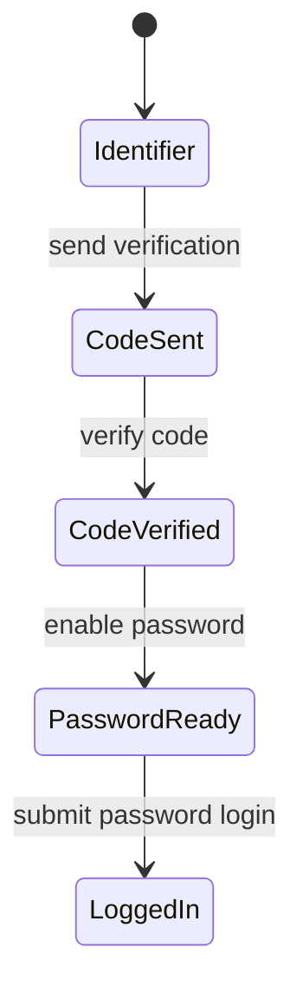

# Frontend

## Surface

The only frontend surface is the Homebridge custom plugin settings UI at `homebridge-ui/public/index.html`. After sign-in it opens **My Devices**, with **Connections** and **Help** as two other tabs. A device's controls and settings live in its detail view.

## Homebridge UI Rules

- The file does not include `<html>`, `<head>`, or `<body>` tags.
- Bootstrap classes may be used because Homebridge injects the environment styling.
- The UI communicates with `homebridge-ui/server.js` through `window.homebridge.request`.
- The Homebridge host wraps this HTML fragment in its iframe, injects `plugin-ui-utils`, and adjusts iframe height from the body. Call `fixScrollHeight()` after view changes and clean up plugin event subscriptions and timers on page hide.
- The UI saves through `window.homebridge.request()` to the custom server's `/save-scope`, `/save-features`, `/save-device-settings`, and `/save-power-specs` handlers. It does not use parent `updatePluginConfig()` or `savePluginConfig()` for these edits.

## Login State Machine

```mermaid
stateDiagram-v2
  [*] --> Identifier
  Identifier --> CodeSent: send verification
  CodeSent --> CodeVerified: verify code
  CodeVerified --> PasswordReady: enable password
  PasswordReady --> LoggedIn: submit password login
```

Password input is disabled until code verification succeeds. Login is disabled until password input contains a value. Auto-login remains the authentication behavior and is explained in the UI.

## Test Anchors

- `tests/ui/login-ui.spec.ts` verifies iframe restrictions, field state, and request order.
- `tests/ui/navigation-workflow.spec.ts` verifies tabs, device detail, draft/focus preservation, delayed responses, and command results.
- `tests/ui/appearance.spec.ts` and `tests/ui/accessibility.spec.ts` cover two languages, two themes, responsive layout, and keyboard access.
- `tests/ui/power-specs.spec.ts` covers registered device rows, blank versus zero, independent device specifications, batch save conflicts, draft/account isolation, estimate eligibility, saved Matter setting changes, and responsive input layout.

## 3.0 beta customer settings

Device settings use stable device identifiers. Drafts, focus, and selection survive status updates and tab/detail navigation; saved changes apply only after the relevant server response. Scope edits require the server's current account and edit token, and old account responses cannot replace the current view. Host language and lighting mode select Korean/English and light/dark presentation. Help holds connection diagnostics, device power specifications, and the separate expert editor for actual meter mappings. Cache presence is never described as completed pairing. Actual meter mappings remain editable as expert JSON and are independent of manual power specifications. UI controls use the runtime command channel and distinguish an acknowledged command from confirmed physical behavior. See the beta guide for supported remote buttons and platform limits.

## Manual power specifications

The power specification section automatically lists current in-scope devices from diagnostics. Its three columns are a read-only device name/model, active watts, and standby watts. Stable device IDs keep identical models independent. No device dropdown, add/remove action, calculator, illustrative row, or live electrical reading is shown. Numbers are finite and between 0 and 1,000,000 W. An empty field is unset; explicit zero is retained. An invalid number input is not treated as an empty field or a request to clear a saved value.

Each device identity cell displays `powerSpecEligibility` from the server's shared runtime `powerEstimateSupport()` helper. Missing eligibility remains unconfirmed; the browser does not reconstruct a separate device-type allowlist. The same row identifies when a power or energy meter profile takes priority. Unsupported specifications remain visible and editable, including explicit clearing; eligibility never silently deletes a saved specification. Korean and English guidance explains specification-based estimation, excluded observation gaps, Matter enablement and restart requirements, and the difference between Homebridge outlet W tiles, unchanged light device types, and controller-dependent Apple Home energy display.

The UI reads `diagnostics.devices[].preference.powerSpec` and requires `deviceListAvailable === true` before saving. This signal requires an owned snapshot whose recorded `discoveryScope` matches the current configured scope. A filtered snapshot cannot establish the first family by array position after a scope change; older snapshots without scope provenance remain unavailable until discovery runs again. Only changed rows are submitted to `/save-power-specs` with `uiSessionRevision`, each device ID, both values (number or null), and `expected` base values for conflict detection. Null removes a field; two null values remove only that device's `powerSpec`. The response acknowledges only submitted rows. Later typing, pending saves, polling, list failures, and stale responses must not overwrite a user's draft. Account changes follow the existing fresh-status and discard-confirmation boundaries.

The server normalizes `features.devices[deviceId].powerSpec` and rejects malformed numbers, duplicate IDs, unknown or out-of-scope devices, account changes, and stale expected values before committing the batch. Other device preferences, other platforms, authentication, scope, and actual meter profiles remain intact. Editing a device's display settings preserves its power specification; power specifications are written through their dedicated route.

These values are user-entered specifications. The runtime uses them with confirmed native power state to publish estimated Matter ElectricalPowerMeasurement and ElectricalEnergyMeasurement with `measured: false`; this settings screen does not display a separate live energy dashboard. Active watts apply to confirmed on and standby watts to confirmed off. Missing wattage or unknown power state is unavailable rather than zero. Accumulation excludes disconnected, offline, unknown-state and restart gaps. Totals persist per account/device, while observation anchors are never restored across restarts. A configured measured power or energy profile suppresses specification-based estimates for that device, including when its measured reading is unavailable, so the two sources do not mix. The existing `features.meters` source-field mappings remain a separate expert setting and continue to require confirmed device fields and units.
