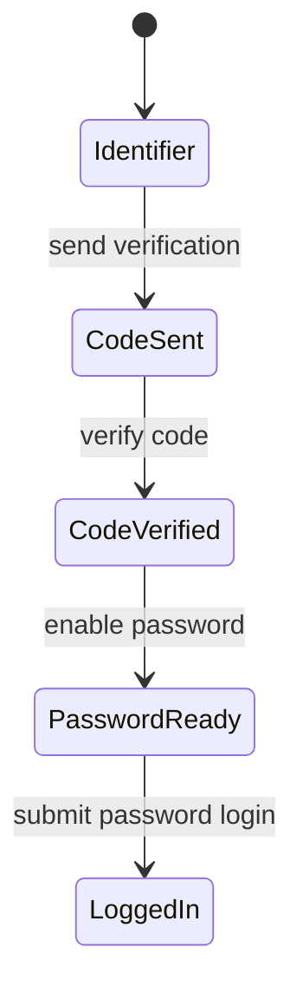

# Frontend

## Surface

The only frontend surface is the Homebridge custom plugin settings UI at `homebridge-ui/public/index.html`.

## Homebridge UI Rules

- The file does not include `<html>`, `<head>`, or `<body>` tags.
- Bootstrap classes may be used because Homebridge injects the environment styling.
- The UI communicates with `homebridge-ui/server.js` through `window.homebridge.request`.
- The UI saves config through `updatePluginConfig()` followed by `savePluginConfig()`.

## Login State Machine

```mermaid
stateDiagram-v2
  [*] --> Identifier
  Identifier --> CodeSent: send verification
  CodeSent --> CodeVerified: verify code
  CodeVerified --> PasswordReady: enable password
  PasswordReady --> LoggedIn: submit password login
```

Password input is disabled until code verification succeeds. Login is disabled until password input contains a value. Auto-login is checked and disabled by design.

## Test Anchors

- `tests/ui/login-ui.spec.ts` verifies iframe restrictions, field state, and request order.

## 2.1 beta customer settings

Device settings use stable device identifiers and preserve drafts/focus during status updates. Host language and lighting mode select Korean/English and light/dark presentation. A diagnostics section distinguishes discovery, bridge preparation and recent reports; cache presence is never described as completed pairing. Expert meter editing and form editing share one saved value. UI controls use the runtime command channel instead of creating competing cloud clients. See the beta guide for supported remote buttons and explicit platform limitations.
